# Lexery Legal AI Agent — Єдина архітектурна діаграма

Вся архітектура в одній Mermaid-діаграмі. Кожен блок: **проста назва** → **технічний блок** → **модель LLM** (де застосовується). Додатково: стратегія API-ключів, проєкти, інфраструктура пам'яті.

---

## ⚡ Швидка довідка

| Що | Дія |
|----|-----|
| **Цикл DocList** | U5 (мало) → U6 → U7 DocList API → **U8a** (які першими) → **U8b** (валідація top 3) → U8 Import (T6→LLDBI) → **U4 repeat retrieval** → U5. |
| **DocList+Import час** | U7 ~1–5 с; T6→O12 (1 акт) ~30 с–2 хв. **Fast mode:** чекати top 1–3 акти, timeout 15–30 с; решта → import_jobs (черга). При timeout: `degrade_reason: import_timeout`. |
| **U8a які акти першими** | 1) Filter Missing (виключити qdrant_status=indexed). 2) Rank за DocList score + boost entities. 3) Pick top N (IMPORT_FAST_MODE_COUNT). 4) Rest → queue. |
| **U8b валідація перед Import** | AI: чи top 3 відповідають запиту? confidence ≥70–80% → імпорт top 3. Інакше → Web (Perplexity Sonar): «де застосовується акт X, які кейси» → re-rank → імпорт 1 найкращий. **Fallback:** якщо Web fail (немає інфи, ліміт вичерпано) → імпорт top 3. |
| **OpenRouter** | 3 ключі: `OPENROUTER_API_KEY_ONLINE` (U2,U6,U10,U11), `OPEN_ROUTER_API_RAG` (U4,U7,O4,O9,MM), `OPENROUTER_API_KEY_WEB` (U8b,U11e — Perplexity Sonar). |
| **Supabase** | 3 проєкти: Main, Legislation, **Memory** (mm_memory_items, mm_summaries, mm_outbox). |
| **Qdrant** | 2 кластери: Legislation (chunks, acts, catalog), **Memory** (lexery_memory_semantic_v1). |
| **R2** | 1 bucket, 3 prefix: legislation/, DocListDB log/, tenant/*/mm/. |
| **Генерація та перевірка** | U9 Assemble (system+user+context, Evidence-only) → U10 Write (gpt-4o, stream) → U11 Verify (U11a Critic → U11b Reranker → U11d StopPolicy). Verdict: complete→U12 | retry→U11c→U4 | need_web→U11e→U11c→U4 | failed→U12. |

---

## 📖 Як читати

Діаграма оформлена в **темній темі** — контрастні кольори, чіткі межі блоків, зручно переглядати.

| Елемент | Значення |
|---------|----------|
| 🔵 **Сині** (темно-синій + голуба рамка) | Онлайн-блоки |
| 🟢 **Зелені** (темно-зелений + зелена рамка) | Пам'ять агента |
| 🟠 **Помаранчеві** (темно-янтарний + помаранчева рамка) | Офлайн DocListDB, LLDBI |
| 🔴 **Рожеві** (темно-бордо + рожева рамка) | Сховища |
| 🟣 **Фіолетові** | API-ключі |
| ⚪ **Сірі** | Зовнішні (User, Frontend, Backend) |
| **🤖** | AI-блок; модель і ключ під блоком |
| **—** | Без AI |

---

## 🗺️ Діаграма

```mermaid
%%{init: {"flowchart":{"curve":"basis","padding":32,"nodeSpacing":55,"rankSpacing":62},"theme":"base","themeVariables":{"darkMode":"true","background":"#0d0d12","primaryTextColor":"#e4e4e7","primaryBorderColor":"#3f3f46","lineColor":"#52525b","secondaryColor":"#18181b","secondaryTextColor":"#a1a1aa","tertiaryColor":"#27272a","mainBkg":"#18181b","secondBkg":"#0f0f12","tertiaryBkg":"#09090b","textColor":"#d4d4d8","fontSize":"12px","fontFamily":"'SF Pro Display', system-ui, -apple-system, sans-serif","clusterBkg":"#18181b","clusterBorder":"#27272a","titleColor":"#fafafa","edgeLabelBackground":"#27272a","nodeBorder":"#3f3f46"}} }%%
flowchart TB
  subgraph EXT["🌐 Зовнішній світ"]
    USR["👤 Користувач"]
    FE["🖥️ Фронтенд"]
    BE["⚙️ Бекенд"]
  end

  subgraph ONLINE["📡 ОНЛАЙН"]
    direction TB
    subgraph INTAKE["1️⃣ Прийом та розуміння"]
      U1["Вхідні двері<br/>────────────────<br/>[U1] Gateway<br/>—"]
      U2["Розуміє запит<br/>────────────────<br/>[U2] Classify<br/>🤖 gpt-4o-mini 🔑ONLINE"]
      U2a["Що хоче юрист?<br/>────────────────<br/>[U2a] IntentClassifier<br/>🤖 gpt-4o-mini 🔑ONLINE"]
      U2b["Яка галузь?<br/>────────────────<br/>[U2b] LegalDomainTagger<br/>🤖 gpt-4o-mini 🔑ONLINE"]
      U2c["Які акти згадані?<br/>────────────────<br/>[U2c] Entity Extractor<br/>🤖 gpt-4o-mini 🔑ONLINE"]
      U2d["Чи неоднозначно?<br/>────────────────<br/>[U2d] Ambiguity Detector<br/>🤖 gpt-4o-mini 🔑ONLINE"]
      U3["Де шукати?<br/>────────────────<br/>[U3] Plan<br/>— rules"]
      U3a["Кроки пошуку<br/>────────────────<br/>[U3a] Plan Builder<br/>— rules"]
    end

    subgraph RETRIEVAL["2️⃣ Пошук доказів"]
      U4["Шукає в LLDBI і пам'яті<br/>────────────────<br/>[U4] CacheRAG<br/>🤖 embed 1536d 🔑RAG"]
      U5["Чи достатньо?<br/>────────────────<br/>[U5] Gate<br/>— rules"]
      U6["Доповнює запит синонімами<br/>────────────────<br/>[U6] Expand<br/>🤖 gpt-4o-mini 🔑ONLINE"]
      U6a["Синоніми<br/>────────────────<br/>[U6a] Synonymizer<br/>🤖 gpt-4o-mini 🔑ONLINE"]
      U7["DocList API: запит → nreg[]<br/>~1–5 с | POST /catalog/resolve<br/>────────────────<br/>[U7] DocList<br/>🤖 embed 768d 🔑RAG"]
      U8["Import: top 1–3 синхронно<br/>timeout 15–30 с, решта → queue<br/>────────────────<br/>[U8] Import<br/>—"]
      U8a["Filter Missing → Rank → Pick top N<br/>Rest → import_jobs<br/>────────────────<br/>[U8a] ActIngestionOrchestrator<br/>— rules"]
      U8b["Валідація top 3: confidence ≥70% → імпорт<br/>&lt;70% → Web(Sonar) → re-rank → 1 акт; fallback: імпорт top 3<br/>────────────────<br/>[U8b] ActRelevanceValidator<br/>🤖 Sonar+gpt-4o-mini 🔑WEB/ONLINE"]
    end

    subgraph GENERATE["3️⃣ Генерація та перевірка"]
      U9["Збирає промпт: system+user+context<br/>Evidence-only, R2 snippets, Memory<br/>────────────────<br/>[U9] Assemble<br/>— rules"]
      U10["LLM генерує відповідь (evidence-only)<br/>stream токенів → U12<br/>────────────────<br/>[U10] Write<br/>🤖 gpt-4o ⚡ 🔑ONLINE"]
      U11["Verify: U11a→U11b→U11d<br/>verdict: complete | retry | need_web | failed<br/>────────────────<br/>[U11] Verify<br/>— rules"]
      U11a["Чи відповідь повна?<br/>────────────────<br/>[U11a] CoverageCritic<br/>🤖 gpt-4o-mini 🔑ONLINE"]
      U11b["Чи цитати вірні?<br/>────────────────<br/>[U11b] CrossEncoderReranker<br/>🤖 reranker"]
      U11c["Уточнений запит<br/>────────────────<br/>[U11c] QueryRefiner<br/>🤖 gpt-4o-mini 🔑ONLINE"]
      U11d["Стоп або ще раз?<br/>────────────────<br/>[U11d] StopPolicy<br/>— rules"]
      U11e["Підказки з інтернету<br/>WebHints: назви актів, keywords<br/>────────────────<br/>[U11e] WebNavigator<br/>🤖 perplexity/sonar 🔑WEB"]
      U12["SSE stream, messages, outbox<br/>index_memory, summarize_case<br/>────────────────<br/>[U12] Deliver<br/>— rules"]
    end
  end

  subgraph MEMORY["🧠 ПАМ'ЯТЬ"]
    direction TB
    MM_SEARCH["Пошук у пам'яті<br/>────────────────<br/>[MM] Search<br/>🤖 embed 1536d 🔑RAG"]
    MM_LOAD["Завантаження контексту<br/>────────────────<br/>[MM] Load<br/>—"]
    MM_OUTBOX["Outbox worker<br/>────────────────<br/>[MM] Outbox<br/>🤖 gpt-4o-mini + embed 🔑RAG"]
    MM_ITEMS[("mm_memory_items")]
    MM_SUM[("mm_summaries")]
    MM_Q[("lexery_memory_semantic")]
  end

  subgraph DOCLIST["📋 DocListDB — каталог актів"]
    direction LR
    T0["[T0] Cron"]
    O2["[O2] Fetch"]
    O3["[O3] Download"]
    O4["[O4] Parse & Embed<br/>🤖 embed 768d 🔑RAG"]
    O1_D["[O1] Store R2"]
    O5["[O5] Supabase"]
    O6["[O6] Qdrant catalog"]
  end

  subgraph LLDBI["📚 ОФЛАЙН LLDBI"]
    direction LR
    T6["[T6] Trigger"]
    O7["[O7] Content"]
    O8["[O8] Chunks"]
    O9["[O9] Embed<br/>🤖 embed 1536d 🔑RAG"]
    O10["[O10] Qdrant chunks"]
    O11["[O11] Qdrant acts"]
    O12["[O12] Mark indexed"]
  end

  subgraph SB["🗄️ SUPABASE — 3 проєкти"]
    SB_MAIN[("SB Main<br/>runs, messages<br/>🔑 SUPABASE_*")]
    SB_LEG[("SB Legislation<br/>legislation_documents<br/>🔑 SUPABASE_LEGISLATION_*")]
    SB_MEM[("SB Memory<br/>mm_memory_items, mm_summaries, mm_outbox<br/>🔑 SUPABASE_MEMORY_*")]
  end

  subgraph R2B["🗄️ R2 — 1 bucket, різні prefix"]
    R2_LEG[("R2 legislation/<br/>canonical, tech/runs<br/>🔑 R2_*")]
    R2_DOC[("R2 DocListDB log/<br/>state, locks<br/>🔑 R2_*")]
    R2_MM[("R2 tenant/*/mm/<br/>attachments, offload<br/>🔑 R2_*")]
  end

  subgraph QDS["🗄️ QDRANT — 2 кластери, 4 колекції"]
    QD_CHUNKS[("QD lexery_legislation_chunks<br/>1536d — U4, O10<br/>🔑 QDRANT_LEGISLATION_*")]
    QD_ACTS[("QD lexery_legislation_acts<br/>1536d — U4, O11<br/>🔑 QDRANT_LEGISLATION_*")]
    QD_CAT[("QD legislation-catalog-index<br/>768d — U7, O6<br/>🔑 QDRANT_LEGISLATION_*")]
    QD_MEM[("QD lexery_memory_semantic_v1<br/>1536d — U4, MM<br/>🔑 QDRANT_MEMORY_*")]
  end

  subgraph API["🔑 API КЛЮЧІ / СЕРВІСИ"]
    K_OR_ONLINE["OpenRouter ONLINE<br/>U2,U6,U10,U11"]
    K_OR_WEB["OpenRouter WEB<br/>perplexity/sonar — U8b,U11e"]
    K_OR_RAG["OpenRouter RAG<br/>U4,U7,O4,O9,MM"]
    RADA["Rada.gov.ua API<br/>O2,O3,O7"]
    DOCL["DocList Resolver API<br/>POST /catalog/resolve → nreg[]<br/>U7"]
    WEB["Perplexity Sonar API<br/>perplexity/sonar — web search<br/>U8b, U11e"]
  end

  USR --> FE --> BE --> U1
  U1 --> U2 --> U2a --> U2b --> U2c --> U2d --> U3 --> U3a --> U4
  U4 --> MM_SEARCH --> MM_LOAD --> U4
  U4 --> U5
  U5 -->|достатньо| U9
  U5 -->|мало| U6 --> U6a --> U7 --> U8a --> U8b --> U8
  U8 -.->|після імпорту top-N або timeout, repeat retrieval| U4
  U8b -.->|низька confidence, web enrichment; fallback → top 3| WEB
  U9 --> U10 --> U11 --> U11a --> U11b --> U11d --> U12
  U11a -.->|retry| U11c -.-> U4
  U11a -.->|web| U11e -.-> U11c
  U8 -.->|тригер| T6
  U12 --> MM_OUTBOX --> MM_ITEMS
  MM_OUTBOX --> MM_SUM
  MM_OUTBOX --> MM_Q

  T0 --> O2 --> O3 --> O4 --> O1_D
  O4 --> O5
  O4 --> O6
  T6 --> O7 --> O8 --> O9 --> O10
  O9 --> O11
  O10 --> O12
  O11 --> O12

  U1 -.-> SB_MAIN
  U4 -.-> QD_CHUNKS
  U4 -.-> QD_ACTS
  U4 -.-> QD_MEM
  U4 -.-> SB_MEM
  U7 -.-> DOCL
  DOCL -.-> QD_CAT
  U7 -.-> SB_LEG
  U8 -.-> SB_LEG
  U9 -.-> R2_LEG
  U9 -.-> SB_MAIN
  U9 -.-> SB_MEM
  U10 -.-> SB_MAIN
  U12 -.-> SB_MAIN
  U12 -.-> SB_MEM
  O1_D -.-> R2_LEG
  T0 -.-> R2_DOC
  O5 -.-> SB_LEG
  O6 -.-> QD_CAT
  O7 -.-> R2_LEG
  O10 -.-> QD_CHUNKS
  O11 -.-> QD_ACTS
  O12 -.-> SB_LEG
  MM_ITEMS -.-> SB_MEM
  MM_SUM -.-> SB_MEM
  MM_Q -.-> QD_MEM
  MM_OUTBOX -.-> R2_MM

  U2 -.-> K_OR_ONLINE
  U2a -.-> K_OR_ONLINE
  U2b -.-> K_OR_ONLINE
  U2c -.-> K_OR_ONLINE
  U2d -.-> K_OR_ONLINE
  U6 -.-> K_OR_ONLINE
  U6a -.-> K_OR_ONLINE
  U10 -.-> K_OR_ONLINE
  U11a -.-> K_OR_ONLINE
  U11c -.-> K_OR_ONLINE
  U11e -.-> K_OR_ONLINE
  U4 -.-> K_OR_RAG
  U7 -.-> K_OR_RAG
  O4 -.-> K_OR_RAG
  O9 -.-> K_OR_RAG
  MM_SEARCH -.-> K_OR_RAG
  MM_OUTBOX -.-> K_OR_RAG
  O2 -.-> RADA
  O3 -.-> RADA
  O7 -.-> RADA
  U7 -.-> DOCL
  U11e -.-> WEB
  U8b -.-> K_OR_ONLINE
  U8b -.-> K_OR_WEB
  U11e -.-> K_OR_WEB

  classDef online fill:#1e3a5f,stroke:#3b82f6,stroke-width:2px,color:#e0f2fe
  classDef memory fill:#0f3d2e,stroke:#22c55e,stroke-width:2px,color:#dcfce7
  classDef offline fill:#3d2e0f,stroke:#f59e0b,stroke-width:2px,color:#fef3c7
  classDef storage fill:#3d1e2e,stroke:#ec4899,stroke-width:2px,color:#fce7f3
  classDef api fill:#2e1f4d,stroke:#a855f7,stroke-width:2px,color:#f3e8ff
  classDef external fill:#27272a,stroke:#71717a,stroke-width:2px,color:#fafafa

  class U1,U2,U2a,U2b,U2c,U2d,U3,U3a,U4,U5,U6,U6a,U7,U8,U8a,U8b,U9,U10,U11,U11a,U11b,U11c,U11d,U11e,U12 online
  class MM_SEARCH,MM_LOAD,MM_OUTBOX,MM_ITEMS,MM_SUM,MM_Q memory
  class T0,O2,O3,O4,O1_D,O5,O6,T6,O7,O8,O9,O10,O11,O12 offline
  class SB_MAIN,SB_LEG,SB_MEM,R2_LEG,R2_DOC,R2_MM,QD_CHUNKS,QD_ACTS,QD_CAT,QD_MEM storage
  class K_OR_ONLINE,K_OR_RAG,K_OR_WEB,RADA,DOCL,WEB api
  class USR,FE,BE external
```

<div style="background: linear-gradient(180deg, #0d0d12 0%, #141419 100%); padding: 2rem; border-radius: 16px; margin: 1.5rem 0; border: 1px solid #27272a;">



</div>

---

## ⏱️ DocList API + Import: логіка часу під час Run

DocList API (U7) і подальший імпорт кандидатів в LLDBI (U8→T6→O7…O12) можуть займати **багато часу**. Мінімальна логіка:

| Етап | Орієнтовний час | Опис |
|------|-----------------|------|
| **U7 DocList API** | ~1–5 с | POST /catalog/resolve — швидко |
| **T6→O7…O12 (один акт)** | ~30 с – 2 хв | fetch Rada, parse, chunk, embed, upsert Qdrant |
| **Повний імпорт 5–10 актів** | 3–15 хв | Неприйнятно чекати в одному Run |

**Стратегія (рекомендована):**

1. **Fast mode:** чекати лише top 1–3 акти (config `IMPORT_FAST_MODE_COUNT`), timeout ~15–30 с на весь етап.
2. Решта кандидатів — **в чергу** (import_jobs), імпорт у фоні.
3. Після timeout або успішного імпорту top-N → **U4 repeat retrieval** з тим, що встигло проіндексуватись.
4. SSE події: `doclist`, `import_start`, `import_waiting`, `import_done` / `import_timeout`.

**Режими:** `fast` (чекати 1–3 акти) | `queue_only` (enqueue, не чекати) | `degraded` (при timeout: `degrade_reason: import_timeout`).

---

## 📋 U8a ActIngestionOrchestrator — які акти першими

**[U8a]** вирішує: які з ActCandidates імпортувати **першими** (fast mode) і які відкласти в чергу. Логіка (4 кроки):

| Крок | Логіка |
|------|--------|
| 1 | **Filter Missing:** перевірка Supabase `legislation_documents` — виключити акти з `qdrant_status=indexed`. |
| 2 | **Rank:** вже відсортовані за DocList score (U7). Опц. boost актів, що збігаються з entities з QueryProfile. |
| 3 | **Pick top N:** `IMPORT_FAST_MODE_COUNT` (1–3) — для синхронного чекання. |
| 4 | **Rest → queue:** решта в `legislation_import_jobs` для фонового імпорту. |

**Вихід:** `[immediate[], queued[]]` для U8b.

---

## ✅ U8b ActRelevanceValidator — валідація перед Import

Перед імпортом top 3 кандидатів **[U8b]** перевіряє, чи вони **дійсно відповідають** запиту користувача (або попередній ланці діалогу). Мета: не імпортувати мусор, якщо DocList повернув нерелевантні акти.

### Логіка (три шляхи)

| Умова | Дія |
|-------|-----|
| **AI confidence ≥ 70–80%** | Top 3 відповідають запиту → передати в U8, імпортуємо всі 3. |
| **AI confidence &lt; 70–80%** | Сумніви → **Web enrichment** (Perplexity Sonar): для кожного з 3 шукаємо в інтернеті «де й у яких кейсах застосовується акт X». Отримуємо контекст. Re-rank з AI → обираємо **1 найкращий** акт → імпортуємо лише його. |
| **Web fail (fallback)** | Якщо Web не вдався: немає достатньо інфи по акту, або перевищено ліміт (WEB_BUDGET_PER_RUN), або timeout — **fallback:** імпортуємо top 3 як є. |

### Пороги

- `ACT_RELEVANCE_THRESHOLD` = 0.70–0.80 (config)
- Нижче порога → вмикається Web enrichment, імпорт лише 1 акта

### Вхід/вихід

- **Вхід:** top 3 ActCandidates з U8a, user query, QueryProfile, опц. попередні повідомлення.
- **Вихід:** `[immediate[], queued[]]` — фільтрований і (за потреби) переранжований список для U8.

### Модель для Web

- **Perplexity Sonar** (`perplexity/sonar`) via OpenRouter — модель з **вбудованим веб-пошуком**, вміє залазити в інтернет і повертати результати з citations.
- Config: `OPENROUTER_API_KEY_WEB`, `WEB_BUDGET_PER_RUN` (ліміт на веб-запити за Run).

### Чому це цікаво

- DocList може повернути акти за векторною схожістю, але не за фактичним застосуванням.
- Perplexity Sonar дає **реальні кейси** («де суди цитували цей закон», «в яких справах застосовували»).
- Re-rank на основі query + web context знижує шанс імпорту нерелевантних актів і економить час T6→O12.
- **Fallback на top 3** забезпечує, що Run не втрачає результатів при збої Web або вичерпаному бюджеті.

---

## 📝 Генерація та перевірка (U9–U12): деталі

### U9 Assemble — збір промпту

**[U9]** збирає повний промпт для LLM. Логіка:

| Блок промпту | Вміст |
|--------------|-------|
| **system** | Інструкції: відповідати **тільки з EvidencePack**; не вигадувати; якщо джерела немає — сказати «немає достатніх даних». |
| **user** | Запит користувача. |
| **context** | Історія діалогу (messages) + **Memory** (mm_*) + **EvidencePack** (RawHits → R2 CanonicalSnippetLoader → текстові витяги з актів). |

**Evidence-only:** Writer бачить лише підтверджений контекст; без джерела — припущення заборонені або явно позначені.

---

### U10 Write — генерація відповіді

**[U10]** викликає LLM (gpt-4o) для генерації відповіді. **Evidence-only instruction** у промпті: не цитувати те, чого немає в EvidencePack. Stream токенів передається в U12 для SSE.

**Model selector:** за `MODEL_POLICY` (напр. gpt-4o для відповідей; fallback gpt-4o-mini при downgrade). Таймаут ~30–40 с; retry при 502/timeout.

---

### U11 Verify — цикл перевірки

**[U11]** оркеструє: U11a (CoverageCritic) → U11b (CrossEncoderReranker) → U11d (StopPolicy).

| Крок | Блок | Дія |
|------|------|-----|
| 1 | **U11a CoverageCritic** | LLM (gpt-4o-mini): чи відповідь покриває аспекти запиту (підстава, процедура, наслідки)? verdict: `complete` / `retry_with_more_evidence` / `need_web` / `failed`. |
| 2 | **U11b CrossEncoderReranker** | Cross-encoder (MiniLM): перевірка цитат — чи extracts відповідають EvidencePack; відфільтрувати «придумані» цитати. |
| 3 | **U11d StopPolicy** | Правила: `VERIFIER_MAX_LOOPS`, budget. stop / continue. |

**Verdict і гілки:**

| Verdict | Дія |
|---------|-----|
| **complete** | → U12 Deliver. |
| **retry_with_more_evidence** | → U11c QueryRefiner (refined_query) → U4 repeat retrieval. |
| **need_web** | → U11e WebNavigator (WebHints) → U11c QueryRefiner → U4 repeat. |
| **failed** | → U12 Deliver (status failed). |

---

### U11a CoverageCritic, U11b CrossEncoderReranker, U11c QueryRefiner, U11d StopPolicy

| Блок | Модель | Призначення |
|------|--------|-------------|
| **U11a** | gpt-4o-mini | Перевірка покриття; verdict + missing aspects. |
| **U11b** | Cross-encoder (ms-marco-MiniLM-L-6-v2) | Перевірка цитат; фільтр нерелевантних extracts. |
| **U11c** | gpt-4o-mini | Refined query для retry retrieval (з missing aspects, опц. WebHints). |
| **U11d** | — rules | max_loops, budget; stop / continue. |

---

### U12 Deliver

**[U12]** віддає відповідь клієнту: SSE stream (`message`, `state`, `status`), збереження `messages`, оновлення RunRecord. **Outbox:** події `index_memory`, `summarize_case` для фонового оновлення пам’яті.

---

## 🤖 Моделі AI по блоках

Усі блоки з AI позначені на діаграмі. `—` = без AI (rules, пороги, збір даних).

| Блок | Модель | Ключ | Примітка |
|------|--------|------|----------|
| **U1** | — | — | Gateway: auth, ліміти, enqueue — rules |
| **U3** | — | — | Plan: SearchPlan з порогів (MIN_HITS_OK, need_deep_retrieval) — rules |
| **U3a** | — | — | Plan Builder: build_plan з DirectCitationsResolver, LLDBI_ActIndex — rules |
| **U5** | — | — | Gate: expand=true/false за RawHits, порогах — rules |
| **U8** | — | — | Import: тригер T6, чекання/queue — rules, оркестрація |
| **U8a** | — | — | ActIngestionOrchestrator: фільтр Missing, сортування за score, pick_top — rules |
| **U8b** | `gpt-4o-mini` (confidence) + `perplexity/sonar` (Web enrichment) | ONLINE + WEB | ActRelevanceValidator: confidence top 3; при низькій — Sonar web search; fallback top 3 |
| **U9** | — | — | Assemble: шаблон промпту, збір ContextPack — rules |
| **U11** | — | — | Verify: оркестратор, делегує U11a/U11b/U11d — rules |
| **U11d** | — | — | StopPolicy: max_loops, budget — rules |
| **U12** | — | — | Deliver: SSE, persist, outbox — rules |
| **U2, U2a, U2b, U2c, U2d** | `gpt-4o-mini` | ONLINE | Класифікація, профіль |
| **U4** | `text-embedding-3-small` 1536d | RAG | Embedding запиту для LLDBI + memory |
| **U6, U6a** | `gpt-4o-mini` | ONLINE | Розширення, синоніми |
| **U7** | `text-embedding-3-small` 768d | RAG | Embedding для пошуку в каталозі |
| **U10** | `gpt-4o` | ONLINE | Основна відповідь ⚡дорого |
| **U11a, U11c** | `gpt-4o-mini` | ONLINE | Critic, QueryRefiner |
| **U11e** | `perplexity/sonar` | WEB | WebNavigator: модель з веб-пошуком, WebHints (назви актів, keywords) |
| **U11b** | Cross-encoder (MiniLM) | локально | Reranker цитат |
| **MM_SEARCH** | `text-embedding-3-small` 1536d | RAG | Семантичний пошук у пам'яті |
| **MM_OUTBOX** | `gpt-4o-mini` + embed 1536d | RAG | summarize_case + index_memory |
| **O4** | embed 768d + `gpt-4o-mini` | RAG | Embedding + aiParsingAssist |
| **O9** | embed 1536d + `gpt-4o-mini` | RAG | Embedding + aiParsingAssist |

---

## 🔑 Сховища та API-ключі — повна матриця

### Supabase (3 окремі проєкти)

| Проєкт | env | Таблиці | Блоки |
|--------|-----|---------|-------|
| **Main** | `SUPABASE_URL`, `SUPABASE_SERVICE_ROLE_KEY` | runs, messages, chat_sessions | U1, U9, U10, U12 |
| **Legislation** | `SUPABASE_LEGISLATION_URL`, `SUPABASE_LEGISLATION_SERVICE_ROLE_KEY` | legislation_documents, legislation_import_jobs | U7, U8, O5, O12 |
| **Memory** | `SUPABASE_MEMORY_URL`, `SUPABASE_MEMORY_SERVICE_ROLE_KEY` | mm_memory_items, mm_summaries, mm_outbox | U4, U9, U12, MM |

### R2 (1 bucket, різні prefix)

| Prefix | env | Блоки |
|--------|-----|-------|
| `legislation/` (canonical, tech/runs) | `R2_*` | U9, O1, O7 |
| `legislation/DocListDB rada gov updater log/` | `R2_*` | T0 (state, locks) |
| `tenant/{id}/mm/` | `R2_*` | MM (attachments, offload) |

### Qdrant (2 кластери, 4 колекції)

| Колекція | Розм. | env | Блоки |
|----------|-------|-----|-------|
| lexery_legislation_chunks | 1536d | `QDRANT_LEGISLATION_*` | U4, O10 |
| lexery_legislation_acts | 1536d | `QDRANT_LEGISLATION_*` | U4, O11 |
| legislation-catalog-index | 768d | `QDRANT_LEGISLATION_*` | U7, O6 |
| lexery_memory_semantic_v1 | 1536d | `QDRANT_MEMORY_*` | U4, MM |

### OpenRouter (3 ключі)

| Ключ | Блоки | Модель |
|------|-------|--------|
| `OPENROUTER_API_KEY_ONLINE` | U2, U2a, U2b, U2c, U2d, U6, U6a, U10, U11a, U11c | gpt-4o-mini, gpt-4o |
| `OPEN_ROUTER_API_RAG` | U4, U7, O4, O9, MM_SEARCH, MM_OUTBOX | text-embedding-3-small |
| `OPENROUTER_API_KEY_WEB` | **U8b**, **U11e** | **perplexity/sonar** — модель з веб-пошуком |

### env приклад (оновлений)

```bash
# === OpenRouter (три ключі) ===
OPENROUTER_API_KEY_ONLINE=sk-or-v1-...   # онлайн U2,U6,U10,U11
OPEN_ROUTER_API_RAG=sk-or-v1-...         # O4,O9, LLDBI/DocListDB
OPENROUTER_API_KEY_WEB=sk-or-v1-...      # U8b,U11e — perplexity/sonar (web search)
WEB_BUDGET_PER_RUN=3                    # макс. веб-запитів за Run (U8b, U11e)

# === Supabase (три проєкти) ===
SUPABASE_URL=https://xxx.supabase.co
SUPABASE_SERVICE_ROLE_KEY=eyJ...

SUPABASE_LEGISLATION_URL=https://yyy.supabase.co
SUPABASE_LEGISLATION_SERVICE_ROLE_KEY=eyJ...

SUPABASE_MEMORY_URL=https://zzz.supabase.co          # НОВИЙ
SUPABASE_MEMORY_SERVICE_ROLE_KEY=eyJ...              # НОВИЙ

# === Qdrant (два кластери/колекції) ===
qdrant_clusterENDPOINT_LEXERY_LEGISLATION_DB=https://...
qdrant_clusterAPI_LEXERY_LEGISLATION_DB=...

QDRANT_MEMORY_URL=https://...                        # НОВИЙ (або той самий кластер, інша колекція)
QDRANT_MEMORY_API_KEY=...                            # НОВИЙ

# === R2 (один) ===
R2_ENDPOINT=https://xxx.r2.cloudflarestorage.com
R2_ACCESS_KEY_ID=...
R2_SECRET_ACCESS_KEY=...
R2_LEGISLATION_BUCKET=legislation
```

---

## 🧠 Інфраструктура пам'яті (Memory Agent)

Окремий проєкт/схема, щоб дані пам'яті не змішувались з legislation та runs.

### Supabase (новий проєкт або schema)

| Таблиця | Призначення |
|---------|-------------|
| `mm_memory_items` | Нотатки, факти: `id`, `user_id`, `tenant_id`, `conversation_id`, `scope_type`, `scope_id`, `content`, `metadata`, `created_at` |
| `mm_summaries` | Резюме діалогів/справ: `id`, `user_id`, `conversation_id`, `scope`, `summary_text`, `message_ids`, `updated_at` |
| `mm_outbox` | Події для воркера: `id`, `conversation_id`, `event_type` (index_memory, summarize_case), `payload`, `status`, `created_at` |

### Qdrant (нова колекція)

| Колекція | Розмірність | Payload |
|----------|-------------|---------|
| `lexery_memory_semantic_v1` | 1536 (як LLDBI) | `user_id`, `tenant_id`, `conversation_id`, `scope`, `content_hash`, `created_at` |

> Використовуйте той самий embedding model що й LLDBI (`text-embedding-3-small` 1536d) для сумісності пошуку.

### R2 (prefix для пам'яті)

| Prefix | Призначення |
|--------|-------------|
| `tenant/{tenant_id}/mm/attachments/` | Великі вкладення |
| `tenant/{tenant_id}/mm/offload/` | Офлоад довгих повідомлень (за політикою) |

### Що створити

1. **Supabase:** Новий проєкт або schema `memory` з таблицями вище + RLS по `tenant_id`, `user_id`.
2. **Qdrant:** Колекція `lexery_memory_semantic_v1` 1536d, distance=Cosine.
3. **Воркер outbox:** Cron/queue читає `mm_outbox`, виконує `index_memory` (embed → Qdrant, insert mm_memory_items), `summarize_case` (LLM → mm_summaries).

---

## 📊 Сценарії на діаграмі

| Сценарій | Шлях |
|----------|------|
| **Основний** | U1→U2→U3→U4→U5→U9→U10→U11→U12 |
| **DocList repeat** | U5 (мало)→U6→U7→**U8a**→**U8b** (валідація top 3)→U8→**U4 repeat**→U5 |
| **Verify retry** | U11→verdict retry→U11c QueryRefiner→U4 repeat |
| **Verify need_web** | U11→verdict need_web→U11e WebNavigator→U11c→U4 repeat |
| **Пам'ять при запиті** | U4→MM_Search→MM_Load→U4 |
| **Пам'ять після** | U12→MM_Outbox |
| **Імпорт акта** | U8→T6→O7→O8→O9→O10→O12 |
| **DocListDB оновлення** | T0→O2→O3→O4→O6 (UpdaterDB) |

> **Деталізовані flowcharts:** [03_DOCLISTDB_DETAILED](mermaid/03_DOCLISTDB_DETAILED.md), [04_LLDBI_DETAILED](mermaid/04_LLDBI_DETAILED.md). Реальність = код у `scripts/legislation/`.

---

## 📐 Експорт

Діаграма в темній темі — при експорті в SVG/PNG фон буде темним.

```bash
npx @mermaid-js/mermaid-cli -i docs/architecture/MEGA_DIAGRAM_FULL.md -o docs/architecture/mega.svg
```

Для презентацій можна відкрити `.md` у [Mermaid Live Editor](https://mermaid.live) і перемкнути тему.
