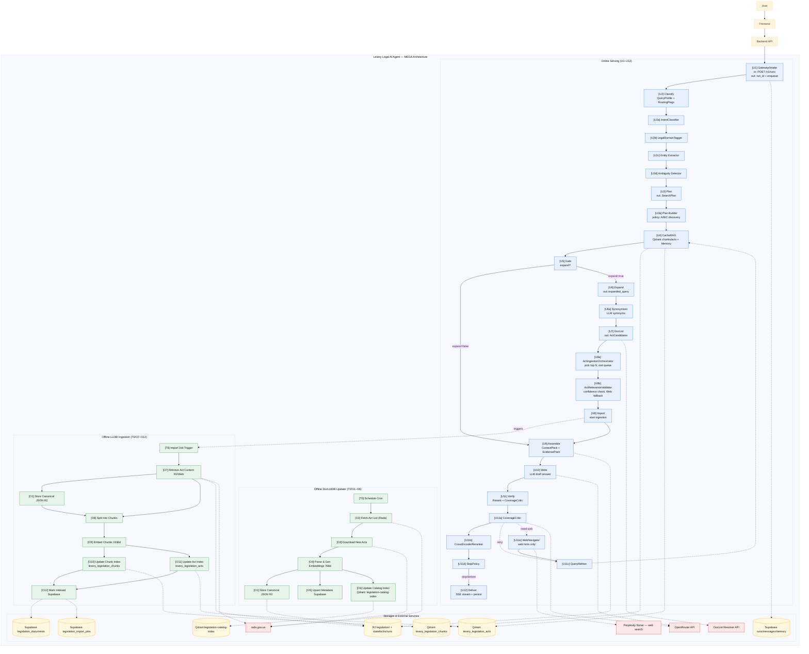

# Lexery Legal AI Agent — MEGA Architecture (Overview)

Один великий flowchart: Online Serving, Offline DocListDB Updater, Offline LLDBI Ingestion, Storages & External Services. ID нод узгоджені з матрицею блоків та 07_BLOCK_CARDS.md.

## Легенда

- **Стрілки суцільні** — основний потік даних/контролю.
- **Стрілки пунктирні** — залежності від сховищ/зовнішніх сервісів або тригери (наприклад U8 → T6).
- **online** (блакитний) — блоки Online Serving.
- **offline** (зелений) — блоки Offline pipelines.
- **storage** (жовтий) — Supabase, Qdrant, R2.
- **external** (червоний) — OpenRouter, Rada, DocList API, Web.

## Примітки

- R2 для DocListDB Updater: prefix `legislation/DocListDB rada gov updater log/`, ключі `state.json`, `locks/daily.lock`, `runs/<run_id>.json`.
- Деталі по кожному блоку — у **02_ONLINE_DETAILED.md**, **03_DOCLISTDB_DETAILED.md**, **04_LLDBI_DETAILED.md** та **07_BLOCK_CARDS.md**.
