# Online Serving — Detailed Flowchart

Деталізований flowchart Online: U1–U12 та підблоки. Кожна нода містить Purpose, Inputs, Outputs, Storage/Deps/Secrets/Timeouts (коротко). Сервіси (Brain API, OpenRouter, Qdrant, Supabase, R2, DocList Resolver) показані як окремі ноди.

```mermaid
%%{init: {"flowchart":{"curve":"basis"},"theme":"base"} }%%
flowchart TB
  subgraph EXT["External"]
    FE[Frontend]
    BE[Backend API]
    OR[OpenRouter API]
    QD[Qdrant]
    SB[Supabase]
    R2S[R2]
    DOCL[DocList Resolver API]
    WEB[Perplexity Sonar — web search]
  end

  subgraph ON["Online Serving — Detailed"]
    U1["[U1] Gateway/Intake<br/>Purpose: прийом POST /v1/runs, перевірка прав, RunRecord<br/>Inputs: user_id, tenant_id, chat settings<br/>Outputs: run_id, enqueue<br/>Storage: RunRecord Postgres, R2 великі вкладення<br/>Secrets: SUPABASE_*, queue URL<br/>Timeouts: кілька с<br/>Obs: run_id, rate rejected"]
    U2["[U2] Classify<br/>Purpose: QueryProfile + RoutingFlags<br/>Inputs: текст запиту, метадані<br/>Outputs: QueryProfile, RoutingFlags<br/>Storage: RunContext, RunRecord.query_profile<br/>Deps: LLM 4o-mini<br/>Secrets: OPENROUTER_API_KEY, CLF_MODEL_ID<br/>Timeouts: ~5 s, retry 1x<br/>Obs: intent, domain, entities"]
    U2a["[U2a] IntentClassifier<br/>Purpose: тип питання<br/>Outputs: intent<br/>Deps: LLM / rules<br/>Не описано в документації: окремі timeout"]
    U2b["[U2b] LegalDomainTagger<br/>Purpose: галузь права<br/>Outputs: domain<br/>Не описано в документації"]
    U2c["[U2c] Entity Extractor<br/>Purpose: акти/статті з запиту<br/>Outputs: entities<br/>Не описано в документації"]
    U2d["[U2d] Ambiguity Detector<br/>Purpose: ознаки неоднозначності<br/>Outputs: routing_flags.ambiguous<br/>Не описано в документації"]
    U3["[U3] Plan<br/>Purpose: SearchPlan, use_cache/doclist/web<br/>Inputs: QueryProfile, feature flags<br/>Outputs: SearchPlan, RoutingFlags<br/>Storage: RunRecord.search_plan<br/>Deps: внутр. правила, MIN_CHUNKS_OK<br/>Timeouts: &lt;100 ms<br/>Obs: use_cache, use_doclist, use_web"]
    U3a["[U3a] Plan Builder<br/>Purpose: Legal Navigator build_plan, A/B/C discovery<br/>Inputs: QueryProfile, pinned_acts<br/>Outputs: SearchPlan steps<br/>Не описано в документації: окремі retries"]
    U4["[U4] CacheRAG<br/>Purpose: пошук LLDBI chunks/acts + Memory<br/>Inputs: SearchPlan, query, refs from U2<br/>Outputs: RawHits[], MemoryRefs<br/>Storage: RunRecord RetrievalTrace<br/>Deps: Qdrant lexery_legislation_chunks/acts, mm_*<br/>Secrets: QDRANT_*, LLDBI_TOP_K, QDRANT_TIMEOUT ~3–5 s<br/>Retries: 1x 0.5 s на Qdrant<br/>Obs: LLDBI_hits, top_score, time"]
    U5["[U5] Gate<br/>Purpose: expand? за RawHits, MIN_HITS_THRESHOLD<br/>Inputs: RawHits[], QueryProfile, RoutingFlags<br/>Outputs: Expand true/false, reason<br/>Storage: RunRecord.flags deep_retrieval<br/>Deps: MIN_HITS_THRESHOLD, doclist_enabled<br/>Obs: Gate expand, reason"]
    U6["[U6] Expand<br/>Purpose: expanded query, синоніми<br/>Inputs: query, Gate flags<br/>Outputs: Expanded Query<br/>Deps: LLM, LEGAL_THESAURUS_PATH<br/>Secrets: OPENROUTER_API_KEY, EXPAND_MODEL_ID<br/>Timeouts: ~5 s, no retry<br/>Obs: expanded query diff"]
    U6a["[U6a] Synonymizer<br/>Purpose: LLM synonyms, Legal Navigator<br/>Outputs: synonyms, terms<br/>Не описано в документації"]
    U7["[U7] DocList<br/>Purpose: catalog resolve, ActCandidates rada_nreg<br/>Inputs: Expanded Query, QueryProfile<br/>Outputs: ActCandidates[]<br/>Deps: DocList Resolver POST /catalog/resolve, Qdrant legislation-catalog-index 768d<br/>Secrets: DOCLIST_API_URL / QDRANT_*<br/>Timeouts: ~5–7 s, retry 1x 1 s<br/>Obs: DocList results N, used_doclist"]
    U8["[U8] Import<br/>Purpose: ініціює імпорт актів у LLDBI, fast 1–3 акти<br/>Inputs: [immediate[], queued[]] з U8b<br/>Outputs: оновлений LLDBI, import_jobs<br/>Storage: legislation_documents indexed<br/>Deps: O7–O12 pipeline, Rada, R2<br/>Secrets: IMPORT_FAST_MODE_COUNT, IMPORT_TIMEOUT_SEC<br/>Obs: Import start N, Fetched act X"]
    U8a["[U8a] ActIngestionOrchestrator<br/>Purpose: Filter Missing → Rank → Pick top N → Rest queue<br/>Inputs: ActCandidates, QueryProfile.entities<br/>Outputs: [immediate[], queued[]] для U8b"]
    U8b["[U8b] ActRelevanceValidator<br/>Purpose: confidence ≥70% → імпорт top 3; &lt;70% → Web(Sonar) → re-rank → 1 акт; fallback: top 3<br/>Inputs: top 3 з U8a, user query<br/>Outputs: [immediate[], queued[]] для U8<br/>Deps: gpt-4o-mini, perplexity/sonar (OPENROUTER_API_KEY_WEB)"]
    U9["[U9] Assemble<br/>Purpose: ContextPack + EvidencePack, prompt для LLM<br/>Inputs: query, history, Memory, EvidencePack, RawHits r2_key<br/>Outputs: Complete Prompt system/dev/user/context<br/>Storage: read messages, R2 snippet load<br/>Deps: R2 CanonicalSnippetLoader, CONTEXT_LIMIT<br/>Secrets: SUPABASE_*, R2_*, CONTEXT_LIMIT<br/>Retries: R2 3x 1 s<br/>Obs: assembled context X msgs Y evidence Z tokens"]
    U10["[U10] Write<br/>Purpose: LLM draft answer, stream<br/>Inputs: Complete Prompt, Model choice<br/>Outputs: Draft Answer, stream tokens<br/>Storage: messages assistant, RunRecord tokens_used, billing_ledger<br/>Deps: OpenRouter, Model Selector<br/>Secrets: OPENROUTER_API_KEY, MODEL_POLICY, MAX_TOKENS_ANSWER<br/>Timeouts: GPT-4 ~30–40 s, retry 1–2x 502<br/>Obs: tokens in/out, cost, duration"]
    U11["[U11] Verify<br/>Purpose: Rerank + CoverageCritic, verdict complete/retry/failed<br/>Inputs: Draft Answer, EvidencePack, QueryProfile<br/>Outputs: Verdict, formatted answer<br/>Storage: RunRecord citations_count, degrade<br/>Deps: LLM Critic / Cross-encoder, StopPolicy<br/>Secrets: VERIFIER_MODEL_ID, VERIFIER_MAX_LOOPS, MIN_COVERAGE_SCORE<br/>Timeouts: Critic ~15 s, retry 1x<br/>Obs: coverage_ok, missing, retrieval loop #k"]
    U11a["[U11a] CoverageCritic<br/>Purpose: покриття аспектів запиту<br/>Outputs: verdict, missing aspects<br/>Не описано в документації"]
    U11b["[U11b] CrossEncoderReranker<br/>Purpose: відфільтрувати сміття, перевірити цитати<br/>Не описано в документації"]
    U11c["[U11c] QueryRefiner<br/>Purpose: refined query для retry retrieval<br/>Не описано в документації"]
    U11d["[U11d] StopPolicy<br/>Purpose: max loops, budget<br/>Не описано в документації"]
    U11e["[U11e] WebNavigator<br/>Purpose: тільки WebHints (candidate_act_titles, keywords)<br/>Deps: perplexity/sonar (OPENROUTER_API_KEY_WEB)"]
    U12["[U12] Deliver<br/>Purpose: SSE GET /v1/runs/run_id/events, finalize RunRecord<br/>Inputs: Verified Answer, run_id<br/>Outputs: stream message/status, messages DB, outbox<br/>Storage: messages, RunRecord completed, billing, outbox<br/>Secrets: ENABLE_SSE, MESSAGE_STREAM_CHUNK_SIZE<br/>Obs: run completed, tokens, cost"]
  end

  FE --> BE --> U1
  U1 --> U2 --> U2a --> U2b --> U2c --> U2d --> U3 --> U3a --> U4 --> U5
  U5 -->|expand=false| U9
  U5 -->|expand=true| U6 --> U6a --> U7 --> U8a --> U8b --> U8 --> U9
  U9 --> U10 --> U11 --> U11a --> U11b --> U11d --> U12
  U11a -.->|retry| U11c --> U4
  U11a -.->|need web| U11e --> U11c
  U8b -.->|низька confidence| WEB

  U2 -.-> OR
  U4 -.-> QD
  U4 -.-> SB
  U6 -.-> OR
  U7 -.-> DOCL
  U8 -.-> SB
  U9 -.-> R2S
  U9 -.-> SB
  U10 -.-> OR
  U11a -.-> OR
  U11e -.-> WEB

  classDef online fill:#E8F0FE,stroke:#1A73E8
  classDef external fill:#FCE8E6,stroke:#D93025
  class U1,U2,U2a,U2b,U2c,U2d,U3,U3a,U4,U5,U6,U6a,U7,U8,U8a,U8b,U9,U10,U11,U11a,U11b,U11c,U11d,U11e,U12 online
  class FE,BE,OR,QD,SB,R2S,DOCL,WEB external
```

## Гілки

- **Gate expand=false** → одразу [U9] Assemble.
- **Gate expand=true** → [U6] Expand → [U6a] Synonymizer → [U7] DocList → [U8a] ActIngestionOrchestrator → [U8b] ActRelevanceValidator → [U8] Import → [U9] Assemble.
- **Verify retry** → [U11c] QueryRefiner → знову [U4] CacheRAG (repair loop).
- **Verify need web** → [U11e] WebNavigator → [U11c] QueryRefiner.

Де значення не описані в plan.md/answer.md — у лейблі вказано «Не описано в документації».
