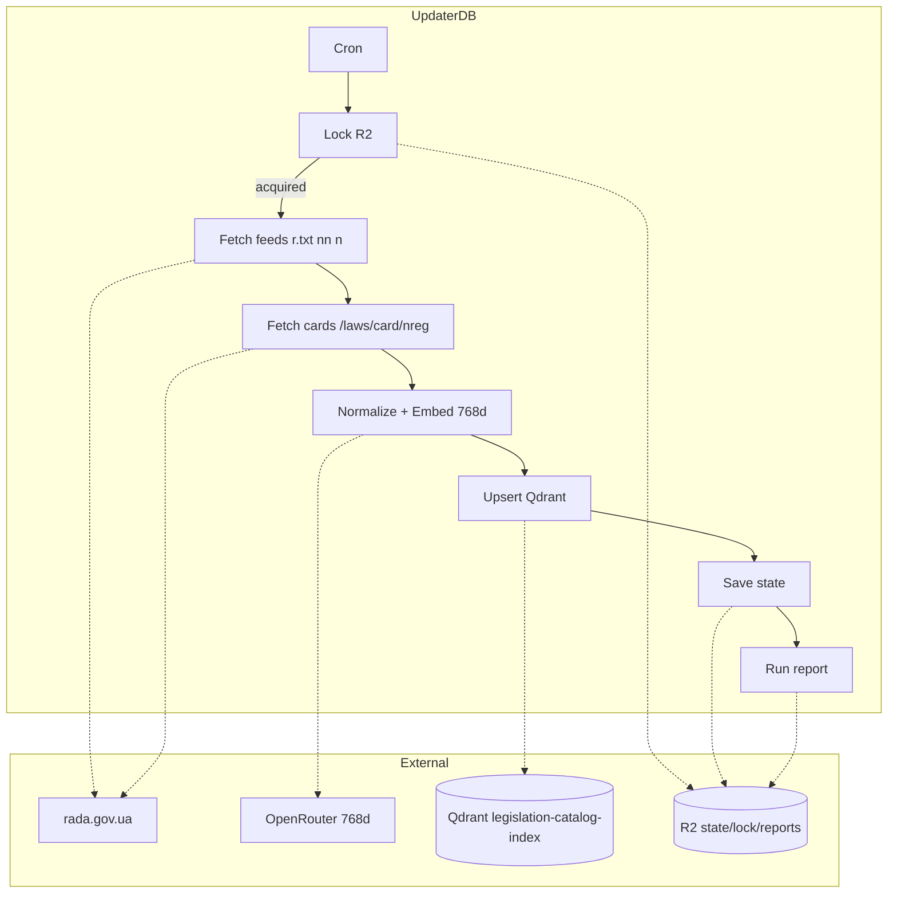

# DocListDB — Повна архітектура (реальність = код)

DocListDB має **три компоненти**:

1. **Full Import Script** — первинне наповнення каталогу (doc.zip/doc.txt → Qdrant).
2. **UpdaterDB** — щоденний інкрементальний оновлювач (Rada feeds + картки → Qdrant). **Основний прод-пайплайн.**
3. **Act Catalog Resolver API** — онлайновий сервіс: `POST /catalog/resolve` → nreg[].

**Повний цикл пошуку (онлайн):** U5 (мало) → U6 Expand → U7 DocList (Resolver API) → nreg[] → U8 Import (T6→LLDBI) → **U4 repeat retrieval** → U5.

---

## UpdaterDB — Реальний пайплайн (з коду)

**Шлях:** `scripts/legislation/Documentation List DB/UpdaterDB/`

UpdaterDB **НЕ зберігає** canonical JSON у R2 і **НЕ пише** у Supabase. Тільки:
- **R2:** state, lock, run report (prefix `legislation/DocListDB rada gov updater log/`).
- **Qdrant:** legislation-catalog-index (768d).

```
Lock (R2) → Load state (R2) → Fetch feeds (r.txt, nn, n) → For each nreg:
  fetch card /laws/card/nreg.json → Compare to Qdrant (retrieve by dokid) →
  if changed: normalize + embed 768d → upsert Qdrant
→ Save state + run report (R2) → Release lock
```

| Крок | Модуль | Що робить |
|------|--------|-----------|
| T0 | Cron (GitHub Actions 02:17 UTC) | Тригер `npm run sync` |
| Lock | `r2/lock.ts` | acquireDailyLock, TTL 3h |
| O2 | `rada/feeds.ts` | r.txt (updated), nn (new today), n (backstop 30d) |
| O3 | `rada/cards.ts` | fetchAndNormalizeCard для кожного nreg |
| O4 | `embedding/client.ts` + qdrant/compare | normalize payload, embed 768d |
| O6 | `qdrant/client.ts` | upsertPoints → legislation-catalog-index |
| State | `r2/state.ts` | state.json: last_modified.r_txt, .nn, .n_backstop |
| Report | `r2/logs.ts` | runs/<run_id>.json |

**Флаги:** `--dry-run`, `--selftest`, `--backstop`, `--max-docs N`, `--skip-retrieve`.

---

## Full Import Script — Первинне наповнення

**Шлях:** `scripts/legislation/Documentation List DB/Full Import Script/`

Інший пайплайн: doc.zip/doc.txt з Rada Open Data → parse → normalize → (опц.) Supabase map → embed 768d → upsert Qdrant.

- **Вхід:** doc.zip, doc.txt (r.txt-подібний список).
- **Вихід:** Qdrant legislation-catalog-index.
- **State:** локально `tmp/` (resume, errors, report).

---

## Act Catalog Resolver API — Онлайн

**Шлях:** `scripts/legislation/Documentation List DB/Act Catalog Resolver API/`

| Параметр | Значення |
|----------|----------|
| **URL** | https://act-catalog-resolver.andriykosrdkgames.workers.dev |
| **Endpoint** | `POST /catalog/resolve` |
| **Вхід** | query, k, candidates, filters, mode (auto \| vector-only \| llm-rerank) |
| **Вихід** | results: [{ nreg, dokid, nazva, score }] |
| **Fast paths** | nreg_exact, nreg_partial (scroll по payload.nreg) |
| **Vector** | Qdrant search 768d, опц. rerank |
| **Cache** | R2 `legislation/ActCatalogResolver/cache/` (CACHE_ENABLED=true) |

---

## R2 State / Locks / Runs (UpdaterDB)

| Ключ | Опис |
|------|------|
| **Prefix** | `legislation/DocListDB rada gov updater log/` |
| **state.json** | last_modified: r_txt, nn, n_backstop; last_success_at, last_backstop_success_at |
| **locks/daily.lock** | TTL 3h (lockTtlSeconds у sync.ts) |
| **runs/<run_id>.json** | kind, stats, changed_examples, errors |

---

## Qdrant Payload Schema (legislation-catalog-index)

- nreg, dokid, nazva, type, organ, status, year, datred, minjust
- source_system: "rada"
- is_in_supabase, supabase_doc_id (опц.)
- types_raw, organs_raw (опц.)

**Embedding:** text-embedding-3-small, 768d. Контракт має збігатися з UpdaterDB і Resolver.

---

## Діаграма UpdaterDB (реальний flow)


