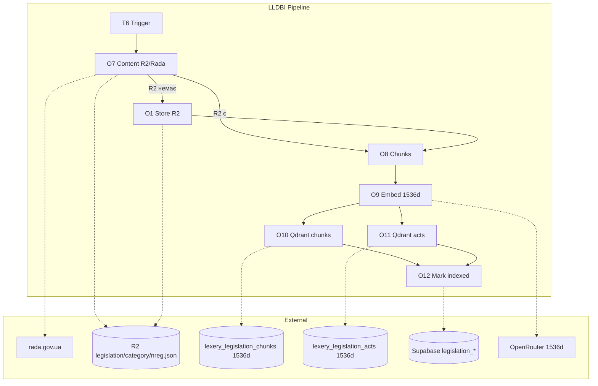

# LLDBI — Повна архітектура (реальність = код)

**Шлях:** `scripts/legislation/Lexery Legislation DB Infra/`  
**Entry:** `admin-cli.ts` → add, verify, remove, inspect, jobs, search.

---

## R2 — Canonical JSON

| Параметр | Значення |
|----------|----------|
| **Bucket** | R2_LEGISLATION_BUCKET (default: `legislation`) |
| **Формат ключа** | `legislation/{category_folder}/{rada_nreg}.json` |
| **Приклад** | `legislation/labor/322-08.json`, `legislation/criminal/2341-14.json` |

**Категорії (r2Path.ts CATEGORY_TO_R2_FOLDER):**

| Taxonomy slug | R2 folder |
|---------------|-----------|
| constitutional | constitutional |
| criminal, criminal_procedure | criminal |
| civil, civil_procedure | civil |
| labor_social | labor |
| administrative, administrative_offenses | administrative |
| tax_customs | tax |
| business_corporate | commercial |
| property_real_estate, construction_urban | land |
| finance_banking | finance |
| energy_utilities | energy |
| defense_mobilization | defense |
| national_security | security |
| border_migration | migration |
| anti_corruption | anti_corruption |
| procurement | procurement |
| healthcare | healthcare |
| education_science | education |
| environment | environment |
| transport_infrastructure | transport |
| local_government | local |
| judiciary_justice | judiciary |
| international_eu | international |
| digital_data | digital |
| other | other |

**Run artifacts:** `legislation/tech/runs/` — report.json, logs.txt, rada_raw.json, canonical.preview.json. Пишуться в tmp → upload R2 → tmp видаляється.

---

## Qdrant

| Колекція | Розмірність | Призначення |
|----------|-------------|-------------|
| lexery_legislation_chunks | 1536d | Фрагменти текстів актів (по chunk) |
| lexery_legislation_acts | 1536d | Один вектор на акт (title + summary + keywords) |

**Payload:** rada_nreg, category, r2_key, json_path, article_number, document_type (chunks); rada_nreg, title (acts).

**Env:** qdrant_clusterENDPOINT_LEXERY_LEGISLATION_DB, qdrant_clusterAPI_LEXERY_LEGISLATION_DB.

---

## Supabase (Legislation)

| Таблиця | Призначення |
|---------|-------------|
| legislation_documents | rada_nreg (PK), title, r2_key, content_hash, qdrant_status (pending/indexed/error), sync_health, expected_chunks, indexed_chunks, document_type_slug, category, validity_status, status_note, act_group_key, rada_datred, indexed_content_hash |
| legislation_import_jobs | id, status (pending/running/completed/failed), total_count, processed_count, success_count, error_count, progress_data (stage: fetched → canonical_built → r2_uploaded → …) |
| legislation_import_proposals | id, rada_nreg, proposed_by, decision (pending/approved/rejected), decision_reason, evidence |

---

## ADD Pipeline (importer.ts)

| Крок | Що |
|------|-----|
| 1 | Supabase: existing doc (content_hash, qdrant_status) |
| 2 | RadaClient.fetchJson, fetchTxt |
| 3 | buildCanonical (parser, chunking, document_type, validity) |
| 4 | generateR2Key (category, nreg) → legislation/{folder}/{nreg}.json |
| 5 | uploadCanonicalJsonToR2 |
| 6 | generateEnrichment (summary, keywords — OpenRouter) |
| 7 | generateEmbedding / generateEmbeddingsBatch (1536d) |
| 8 | QdrantRagClient: upsert acts, потім chunks |
| 9 | Supabase: INSERT/UPDATE legislation_documents |
| 10 | updateJobProgress → legislation_import_jobs |

---

## Діаграма LLDBI

