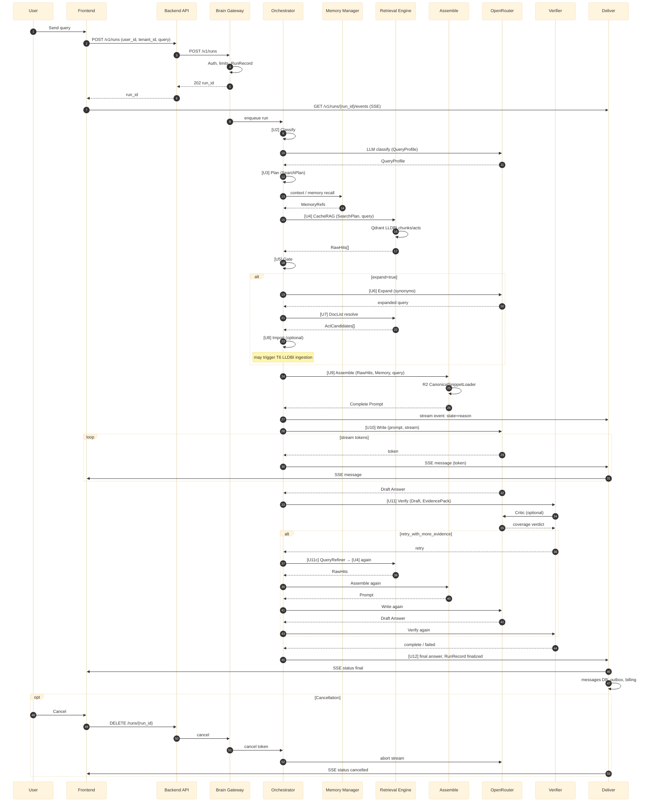

# Online Processing — Sequence Diagram

Sequence diagram для онлайн-обробки: User/Frontend → Brain (/v1/runs) → Orchestrator → Retrieval → Assemble → OpenRouter → Critic → SSE Deliver. Показані stream events, verify loop, cancellation.

## Події стріму (StreamEvent)

- **state** — classify | plan | memory | retrieve | doclist | import | reason | verify | write | deliver
- **message** — контент відповіді (токени/чанки)
- **status** — final | cancelled | timeout
- **progress** — step_i / step_n
- **cost_so_far_usd**, **citations_count**, **mode**, **degrade_reason**

Джерело: plan.md Appendix A9.1 StreamEvent, answer.md [U12] Deliver.
