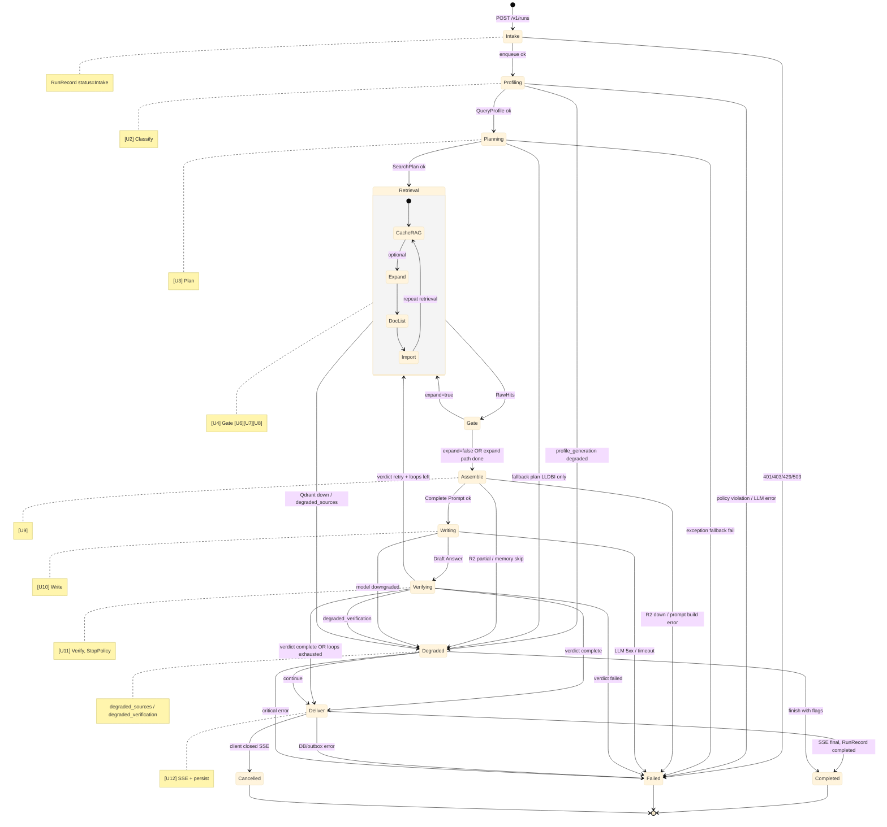

# Run State Machine

State diagram для життєвого циклу Run: Intake → Profiling → Planning → Retrieval → Assemble → Writing → Verifying → Deliver → Completed. Додатково: Failed, Cancelled, Degraded.

## Стани

| Стан | Опис | RunRecord.status |
|------|------|------------------|
| **Intake** | Прийом запиту, перевірка прав/лімітів | Intake |
| **Profiling** | [U2] Classify, QueryProfile | (in-memory) |
| **Planning** | [U3] Plan, SearchPlan | (in-memory) |
| **Retrieval** | [U4] CacheRAG, опц. [U6][U7][U8] | (in-memory) |
| **Assemble** | [U9] ContextPack + EvidencePack | (in-memory) |
| **Writing** | [U10] Write, stream | drafting |
| **Verifying** | [U11] Verify, CoverageCritic | (in-memory) |
| **Deliver** | [U12] SSE final, messages, outbox | (finalizing) |
| **Completed** | Успішне завершення | completed |
| **Failed** | Помилка (timeout, 5xx, policy) | failed |
| **Cancelled** | Користувач скасував (DELETE /runs) | cancelled |
| **Degraded** | Часткова деградація (Qdrant down, no critic) | completed з flags |

## Переходи з таймауту

- З будь-якого стану (Retrieval, Assemble, Writing, Verifying) при перевищенні **max_run_duration_sec** або крокового таймауту → **Failed** (timeout).
- **Cancelled** — при DELETE /runs/{id} або закритті SSE клієнтом.

## Import (U8) під час Retrieval

DocList API (U7) і імпорт актів (U8→T6→O7…O12) можуть займати **багато часу** (десятки секунд на акт). Логіка:

- **Fast mode:** чекати лише top 1–3 акти (IMPORT_FAST_MODE_COUNT), timeout ~15–30 с.
- При **Import timeout** → Retrieval переходить далі (Gate → Assemble) з `degrade_reason: import_timeout`; repeat U4 з тим, що встигло проіндексуватись.
- Решта кандидатів → import_jobs (черга), імпорт у фоні.

Детально: [LEXERY_LEGAL_AI_AGENT_ARCHITECTURE.md §5.2](../LEXERY_LEGAL_AI_AGENT_ARCHITECTURE.md#52-doclist-api--import-логіка-часу-під-час-run), [MEGA_DIAGRAM_FULL.md §DocList API + Import](../MEGA_DIAGRAM_FULL.md#-doclist-api--import-логіка-часу-під-час-run).

---

Джерело: answer.md матриця блоків, plan.md §2 Gateway, Findings answer.md (cancellation, timeout).
